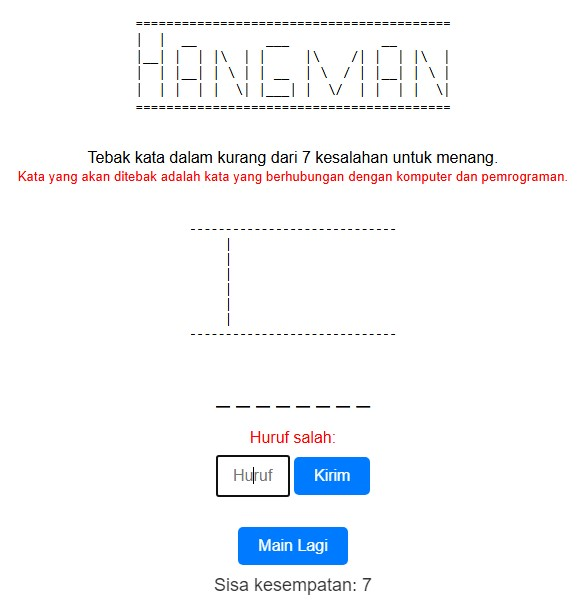
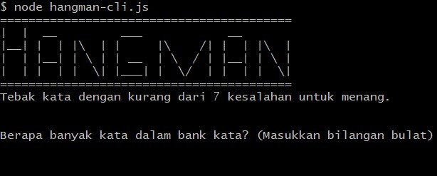

# 🎮 Hangman Game

Implementasi permainan Sudoku dalam dua versi - CLI (Command Line Interface) dan Web berbasis HTML. Game ini dibangun menggunakan JavaScript dengan fitur lengkap permainan Hangman klasik.

<p align="center">
  
</p>

## 📝 Deskripsi

Hangman adalah permainan tebak kata klasik yang telah diimplementasikan dalam dua versi: CLI (Command Line Interface) dan Web. Permainan ini menguji kemampuan Anda untuk menebak kata dengan jumlah kesalahan yang terbatas.

## Versi CLI (Command Line Interface)

Versi CLI dari Hangman ditulis dalam JavaScript dan dapat dijalankan di lingkungan Node.js. Ini adalah cara yang menyenangkan untuk bermain Hangman langsung dari terminal Anda.

### 🎯 Cara Bermain

1. Pastikan Anda memiliki Node.js terinstal di sistem Anda.
2. Clone repositori ini ke komputer Anda.
3. Navigasikan ke direktori proyek dan jalankan perintah berikut:

   ```bash
   node hangman-cli.js
   ```

4. Ikuti instruksi di terminal untuk memulai permainan.



## Versi Web

Versi Web dari Hangman memberikan antarmuka pengguna yang interaktif dan dapat dimainkan di browser web. Ini adalah cara yang lebih visual untuk menikmati permainan.

### Cara Menjalankan

1. Clone repositori ini ke komputer Anda.
2. Buka file `hangman.html` di browser web Anda.
3. Mulailah bermain dengan menebak huruf dan lihat apakah Anda bisa menebak kata sebelum hangman selesai ditampilkan.

## ✨ Fitur

- **Versi CLI:**
  - Antarmuka berbasis teks.
  - Memungkinkan pengguna untuk memasukkan kata-kata mereka sendiri.
  - Menampilkan gambar hangman berbasis teks.

- **Versi Web:**
  - Antarmuka pengguna yang interaktif.
  - Animasi hangman yang ditampilkan secara visual.
  - Menampilkan sisa kesempatan dan huruf yang salah.

## 🙏 Keterangan

- Terinspirasi dari permainan Sudoku klasik project https://github.com/AaronChelvan/hangman
- UI/UX design terinspirasi dari berbagai implementasi Sudoku modern
